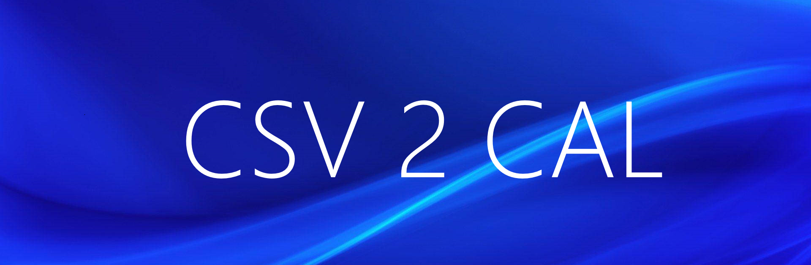
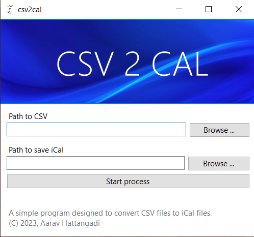

A simple program for Windows to convert CSV files into an iCal calendar with all-day events.


## Screenshots



## Installation

Download the latest version from the releases page, then run the stand-alone executable.
    
## Development
This is a WinForms application based on .NET 6.0. Development on this was carried out in VS2022.

You will need the following pre-requisites to work on this project:
- [ ] .NET 6 SDK
- [ ] Visual Studio 2022
- [ ] .NET Desktop Develoment Workload

---

Clone this repository
```bash
git clone https://github.com/ahattangadi/csv2cal.git
```

Install dependencies
```bash
dotnet restore
```

Run the project
```bash
dotnet run
```


## Acknowledgements

 - [iCal.NET](https://github.com/rianjs/ical.net)

